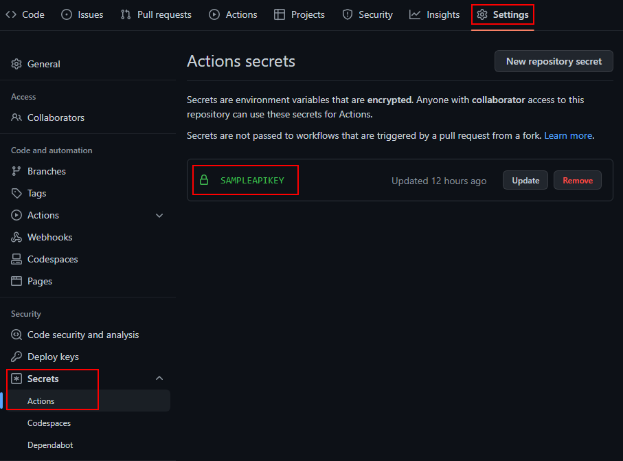
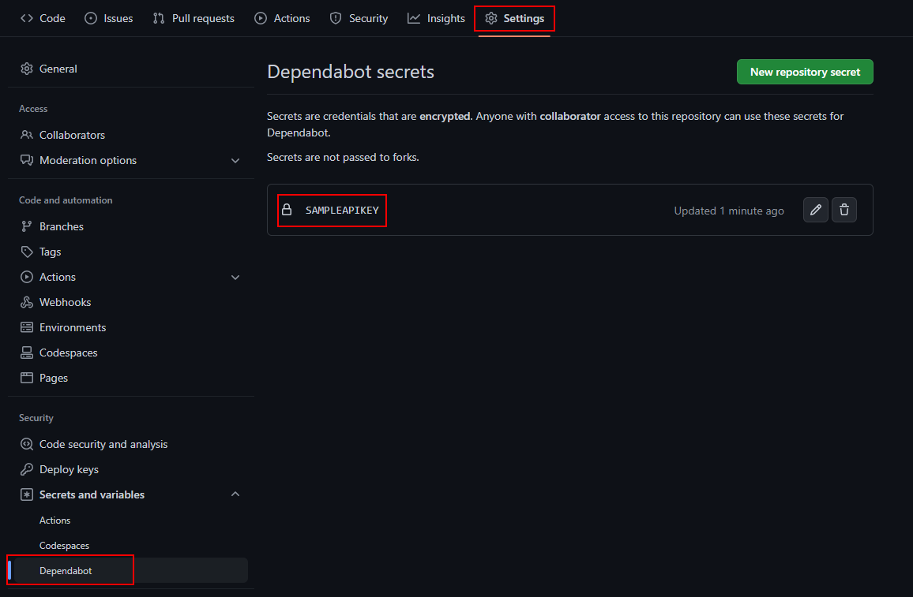

# Secrets をローカルとGitHubで使用する方法

⚠️ **_This repository is intended for me._**

ローカルと GitHub 上の CI の両方でシークレットを扱う方法を考えてみます。

## ソリューションの準備

```ps1
dotnet new sln
```

## アプリでのシークレット

アプリでシークレットを利用してみます。

### 1. プロジェクトの準備

```ps1
dotnet new console -o ConsoleApp
dotnet sln add ConsoleApp
```

### 2. NuGet パッケージの参照追加

```ps1
dotnet add ConsoleApp package Microsoft.Extensions.Configuration.Binder
dotnet add ConsoleApp package Microsoft.Extensions.Configuration.UserSecrets
```

### 3. シークレットの準備

```ps1
dotnet user-secrets -p ConsoleApp init
```

### 4. シークレットの設定と確認

```ps1
dotnet user-secrets -p ConsoleApp set "AppSettings:User" "ゆーざ"
dotnet user-secrets -p ConsoleApp set "AppSettings:ApiKey" "きー"

dotnet user-secrets -p ConsoleApp list
```

### 5. コードからシークレット取得

```cs
using System.Reflection;
using Microsoft.Extensions.Configuration;

var config = new ConfigurationBuilder()
    .AddUserSecrets(Assembly.GetExecutingAssembly())
    .Build();

// インデクサによる取得
Console.WriteLine($"indexer: {config["AppSettings:User"]} {config["AppSettings:ApiKey"]}");

// POCO へのマッピングによる取得
var appSetting = config
    .GetSection(nameof(AppSettings))
    .Get<AppSettings>();

Console.WriteLine($"POCO: {appSetting.User} {appSetting.ApiKey}");

public class AppSettings
{
    public string User { get; set; }
    public string ApiKey { get; set; }
}
```

## Unit Test でのシークレット(環境変数版)

Unit Test でシークレットを利用してみます。
GitHub Actions からも利用したいので環境変数へアクセスできるようにします。

### 1. プロジェクトの準備

```ps1
dotnet new xunit -o ConsoleApp.Test
dotnet sln add ConsoleApp.Test
```

### 2. NuGet パッケージの参照追加

```ps1
dotnet add ConsoleApp.Test package Microsoft.Extensions.Configuration.Binder
dotnet add ConsoleApp.Test package Microsoft.Extensions.Configuration.EnvironmentVariables
dotnet add ConsoleApp.Test package Microsoft.Extensions.Configuration.UserSecrets
```

### 3. シークレットの準備

```ps1
dotnet user-secrets -p ConsoleApp.Test init
```

### 4. シークレットの設定と確認

```ps1
dotnet user-secrets -p ConsoleApp.Test set "User" "Testゆーざ"
dotnet user-secrets -p ConsoleApp.Test set "ApiKey" "Testきー"

dotnet user-secrets -p ConsoleApp.Test list
```

### 5. コードからシークレット取得

```cs
using Microsoft.Extensions.Configuration;

namespace ConsoleApp.Test;

public class UnitTest1
{
    private readonly IConfiguration _config;
    public UnitTest1()
    {
        _config = new ConfigurationBuilder()
            .AddUserSecrets<UnitTest1>() // (A) for local
            .AddEnvironmentVariables()   // (B) for dotnet test env in github actions
            .Build();
    }

    [Fact]
    public void Test_User()
    {
        var actual = _config["user"];
        Assert.Equal("Testゆーざ", actual);
    }

    [Fact]
    public void Test_ApiKey()
    {
        var actual = _config["apikey"];
        Assert.Equal("Testきー", actual);
    }
}
```

## GitHub Actions

### 1. GitHub Actions secrets の準備



### 2. Workflow の設定

```yml
# ...
      - name: 🧪 Test
        working-directory: src
        run: dotnet test --configuration $env:Configuration --no-build --verbosity normal
        env:
          user: ゆーざTest
          apikey: ${{ secrets.SAMPLEAPIKEY }}
          Configuration: ${{ matrix.configuration }}
# ...
```

## Dependabot secrets

Dependabot には GitHub Secrets にアクセスする権限がないので前述の Workflow に `${{ secrets.SAMPLEAPIKEY }}` で指定したシークレットが取得できずに `dotnet test` が失敗します。
* [GitHub Actions: Workflows triggered by Dependabot PRs will run with read\-only permissions \| GitHub Changelog](https://github.blog/changelog/2021-02-19-github-actions-workflows-triggered-by-dependabot-prs-will-run-with-read-only-permissions/)
* [Accessing secrets \- GitHub Docs](https://docs.github.com/en/code-security/dependabot/working-with-dependabot/automating-dependabot-with-github-actions#accessing-secrets)

### 1. Dependabot secrets の準備



Dependabot からシークレットへアクセスするには Dependabot secrets ストアに格納することで `${{secrets.NAME}}` のようにアクセスできるようになります。
* [Configuring access to private registries for Dependabot \- GitHub Docs](https://docs.github.com/en/code-security/dependabot/working-with-dependabot/configuring-access-to-private-registries-for-dependabot)
* [About encrypted secrets for Dependabot \- GitHub Docs](https://docs.github.com/en/code-security/dependabot/working-with-dependabot/configuring-access-to-private-registries-for-dependabot#about-encrypted-secrets-for-dependabot)

## シークレット

User Secrets を格納した `secrets.json` は、あくまでも**開発環境**に限り構成プロバイダが有効になります。

実稼働では**運用環境**となるので環境変数にてシークレットを提供するほうが良いみたいです。

階層キー（`:` 区切り記号）は環境変数では対応していないので `__`（ダブルアンダースコア）を指定する必要があります。
ちなみに `__` は自動で `:` に置換されるのでコード上の変更は不要です。

* json
  ```json
  "Position": {
    "Title": "Editor",
    "Name": "Joe Smith"
  }
  ```
* C#
  ```cs
  var title = Configuration["Position:Title"];
  var name = Configuration["Position:Name"];
  ```

* .NET CLI
  ```ps1
  dotnet user-secrets set "Position:Title" "Editor"
  dotnet user-secrets set "Position:Name" "Joe Smith"
  ```

* cmd.exe
  ```bat
  setx ASPNETCORE_ENVIRONMENT Staging /M
  setx Position__Title Environment_Editor /M
  setx Position__Name Environment_Rick /M
  ```

* pwsh
  ```ps1
  [Environment]::SetEnvironmentVariable("ASPNETCORE_ENVIRONMENT", "Staging", "Machine")
  [Environment]::SetEnvironmentVariable("Position__Title", "Environment_Editor", "Machine")
  [Environment]::SetEnvironmentVariable("Position__Name", "Environment_Rick", "Machine")
  ```

## 参考
* [Azure 向けの GitHub Actions の variable substitution を使用する \| Microsoft Docs](https://docs.microsoft.com/ja-jp/azure/developer/github/github-variable-substitution)
* [Using secrets safely in development with \.NET Core – Sam Learns Azure](https://samlearnsazure.blog/2020/06/17/using-secrets-safely-in-development-with-net-core/)
* [Avoid Secrets in DotNet Core Tests\.](https://patrickhuber.github.io/2017/07/26/avoid-secrets-in-dot-net-core-tests.html)
* [Using User Secrets Configuration In \.NET \- \.NET Core Tutorials](https://dotnetcoretutorials.com/2022/04/28/using-user-secrets-configuration-in-net/)

## 参考（その２）
* [暗号化されたシークレット \- GitHub Docs](https://docs.github.com/ja/actions/security-guides/encrypted-secrets)
* [Managing Secrets in \.NET Console Apps](https://swharden.com/blog/2021-10-09-console-secrets/)
* [integration testing \- How to configure \.net core 3\.1 appsettings to run tests on Github actions \- Stack Overflow](https://stackoverflow.com/questions/62220945/how-to-configure-net-core-3-1-appsettings-to-run-tests-on-github-actions)
* [Microsoft\.Extensions\.Configuration\.UserSecrets 6\.0\.0\-preview\.1\.21102\.12 throwing secrets\.json error in CI/CD pipelines · Issue \#48485 · dotnet/runtime](https://github.com/dotnet/runtime/issues/48485)
* [Dotnet6 upgrade with recommended solution by samsmithnz · Pull Request \#3 · samsmithnz/UserSecretsRegression](https://github.com/samsmithnz/UserSecretsRegression/pull/3/files)

## 参考（その３）
* [How to manage secrets in \.NET locally and on GitHub? \- Maytham Fahmi](https://itbackyard.com/how-to-manage-secrets-in-net-locally-and-on-github/)
* [GitHub Actions: Workflows triggered by Dependabot PRs will run with read\-only permissions \| GitHub Changelog](https://github.blog/changelog/2021-02-19-github-actions-workflows-triggered-by-dependabot-prs-will-run-with-read-only-permissions/)
* [Accessing secrets \- GitHub Docs](https://docs.github.com/en/code-security/dependabot/working-with-dependabot/automating-dependabot-with-github-actions#accessing-secrets)
* [Configuring access to private registries for Dependabot \- GitHub Docs](https://docs.github.com/en/code-security/dependabot/working-with-dependabot/configuring-access-to-private-registries-for-dependabot)
* [About encrypted secrets for Dependabot \- GitHub Docs](https://docs.github.com/en/code-security/dependabot/working-with-dependabot/configuring-access-to-private-registries-for-dependabot#about-encrypted-secrets-for-dependabot)
